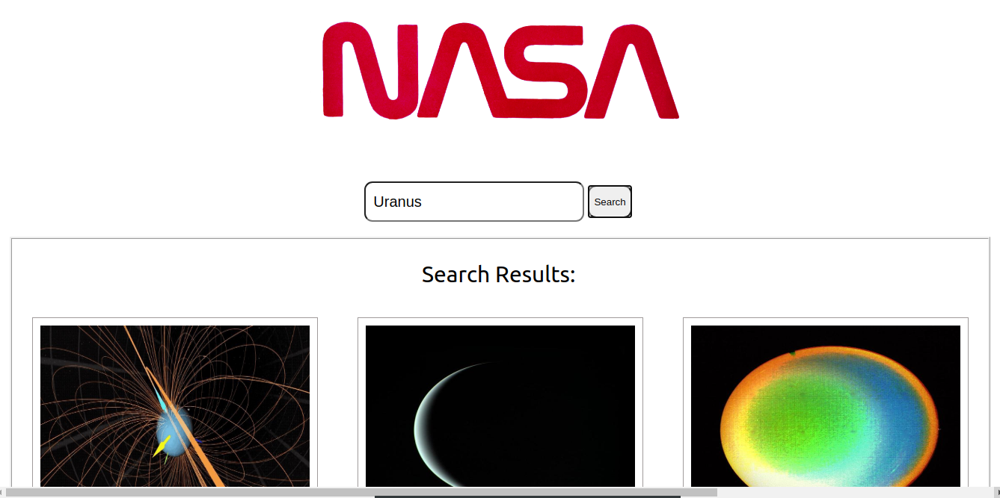
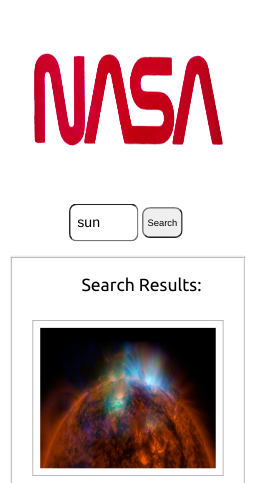

# Nasa tech-test

I was set the task of building a React web application that allows users to search for images based on a query relating to space. 

The following functionalities needed to be implemented:

-  A Search page which allows users to search for images by keyword
-  Images must be returned upon a successful search

## Setup

Clone my repo and open index.html, it will open a tab in your browser or follow the link https://etrovavica1221.github.io/tech-test/ .

    
Desktop view

    
    
Mobile view

    

## Technologies

The project was made with React using hooks.

The following packages were used:

- Axios
- PropTypes

## Testing utilities 

- Jest
- React Testing Library

## Contributing

Pull requests are welcome. For major changes, please open an issue first to discuss what you would like to change.

## Author

Created by Viktoriia Petrova as part of <a href="https://www.manchestercodes.com" target="_blank">Manchester Codes</a> learning process.
